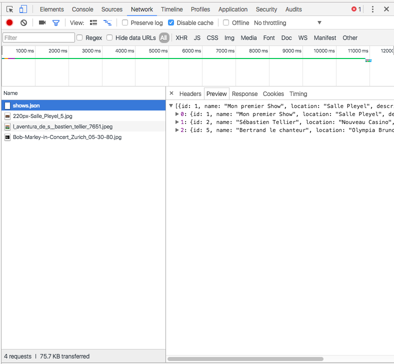

Mobile Workshop #2
=======


Objectifs de l'atelier :

* Apprendre à faire des appels sur l'API
* Récupérer la liste des spectacles sur l'API
* Implémenter la réservation


Pré-requis :

* Mobile Workshop 1
* Si votre API n'est pas prête, vous pouvez utiliser l'URL `api-shows-tonight.herokuapp.com` pour avancer sur ce workshop.

Ressources :

* http://mcgivery.com/ionic-using-factories-and-web-services-for-dynamic-data/


## Etape 1 : Récupération de la liste

### Modification de la factory

On va commencer par aller modifier le fichier `www/js/services.js` :

* On va modifier la définition de la factory pour signaler à Ionic qu'on a besoin de la librairie `$http` : `factory('Shows', function($http) {`
* On va supprimer le contenu artificiel de la variable `shows` et écrire : `var shows = []` car au lancement de l'application on a pas de contenu.
* Ensuite, on va modifier la fonction `all` pour aller récupérer la liste des shows sur l'API avec ce code :
```
    all: function() {
      return $http.get("https://api-shows-tonight.herokuapp.com/shows.json")
        .then(function(response) {
          shows = response.data;
          return shows;
        })
    },
```
* Concrètement, elle effectue 3 opérations :
  * on utilise la libraire `$http` de Ionic / Angular pour effectuer un appel de type `GET` sur l'URL `https://api-shows-tonight.herokuapp.com/shows.json`
  * cette propriété utilise un système de *Promesses*, ce qui signifie que le premier appel peut prendre du temps et qu'on va utiliser la méthode `.then(` pour traiter la réponse.
  * la réponse est brute : elle contient des données mais aussi des headers, un code de réponse etc... On va récupérer la partie "data", et stocker ça dans notre variable "shows".

Grâce à cette première étape, on récupère bien les données comme on peut le voir dans un chrome via l'onglet "Networks" de l'inspecteur.



Par contre, on ne voit pas les spectacles dans l'application. C'est à cause de nos promesses : auparavant, on récupérait instantanément la liste des spectacles, maintenant cette récupération est *asynchrone*. On va donc devoir modifier très légèrement notre controller pour prendre en compte cette modification.

* Dans le fichier `www/js/controllers.js`, on va modifier la ligne par `$scope.shows = Shows.all();` par ce code, prenant en compte les promesses :
```
$scope.shows = [];
  Shows.all().then(function(apiShows) {
    $scope.shows = apiShows;
  });
```

Maintenant, il y aura quelques instants sans aucun spectacles (car on commence par définir la variable `$scope.shows` vide), et dès que l'appel sur l'API aura fonctionné, on pourra voir la liste des spectacles en direct depuis l'API !


