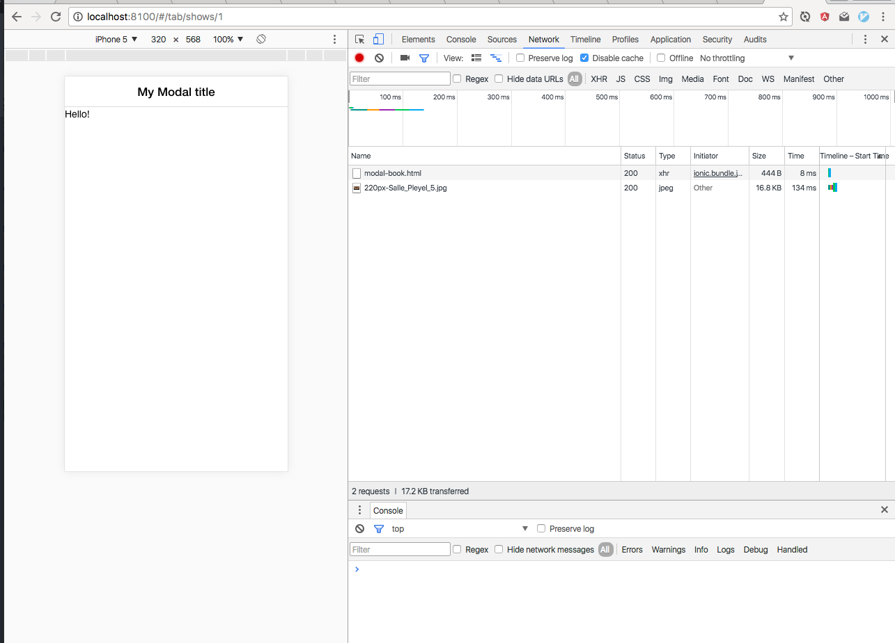

Mobile Workshop #2
=======


Objectifs de l'atelier :

* Apprendre à faire des appels sur l'API
* Récupérer la liste des spectacles sur l'API
* Implémenter la réservation


Pré-requis :

* Mobile Workshop 1
* Si votre API n'est pas prête, vous pouvez utiliser l'URL `api-shows-tonight.herokuapp.com` pour avancer sur ce workshop.

Ressources :

* http://mcgivery.com/ionic-using-factories-and-web-services-for-dynamic-data/


## Etape 1 : Récupération de la liste

### Modification de la factory

On va commencer par aller modifier le fichier `www/js/services.js` :

* On va modifier la définition de la factory pour signaler à Ionic qu'on a besoin de la librairie `$http` : `factory('Shows', function($http) {`
* On va supprimer le contenu artificiel de la variable `shows` et écrire : `var shows = []` car au lancement de l'application on a pas de contenu.
* Ensuite, on va modifier la fonction `all` pour aller récupérer la liste des shows sur l'API avec ce code :
```
    all: function() {
      return $http.get("https://api-shows-tonight.herokuapp.com/shows.json")
        .then(function(response) {
          shows = response.data;
          return shows;
        })
    },
```
* Concrètement, elle effectue 3 opérations :
  * on utilise la libraire `$http` de Ionic / Angular pour effectuer un appel de type `GET` sur l'URL `https://api-shows-tonight.herokuapp.com/shows.json`
  * cette propriété utilise un système de *Promesses*, ce qui signifie que le premier appel peut prendre du temps et qu'on va utiliser la méthode `.then(` pour traiter la réponse.
  * la réponse est brute : elle contient des données mais aussi des headers, un code de réponse etc... On va récupérer la partie "data", et stocker ça dans notre variable "shows".

Grâce à cette première étape, on récupère bien les données comme on peut le voir dans un chrome via l'onglet "Networks" de l'inspecteur.


Par contre, on ne voit pas les spectacles dans l'application. C'est à cause de nos promesses : auparavant, on récupérait instantanément la liste des spectacles, maintenant cette récupération est *asynchrone*. On va donc devoir modifier très légèrement notre controller pour prendre en compte cette modification.

### Modification du controller

* Dans le fichier `www/js/controllers.js`, on va modifier la ligne par `$scope.shows = Shows.all();` par ce code, prenant en compte les promesses :
```
$scope.shows = [];
  Shows.all().then(function(apiShows) {
    $scope.shows = apiShows;
  });
```

Maintenant, il y aura quelques instants sans aucun spectacles (car on commence par définir la variable `$scope.shows` vide), et dès que l'appel sur l'API aura fonctionné, on pourra voir la liste des spectacles en direct depuis l'API !


## Etape 2 : Réservation d'une place 

On a appris à faire un appel `GET` simple permettant de récupérer des données. Maintenant, on va aller effectuer un appel plus complexe pour y envoyer des données, un appel `POST`.

### Ressources 

Si tout n'est pas toujours expliqué en détail, c'est que l'information se trouve dans la documentations d'Ionic.
* Concernant les `modal`, tout est expliqué ici : (http://ionicframework.com/docs/api/service/$ionicModal/)[http://ionicframework.com/docs/api/service/$ionicModal/]
* Concernant les `ìnputs`, on trouve de la documentation ici : (http://ionicframework.com/html5-input-types/#text)[http://ionicframework.com/html5-input-types/#text] et 

### Le service

Une fois encore, on va commencer par modifier notre fichier de `services` ppur y ajouter une fonction permettant de réserver. A la suite des méthodes `all` et `get` on va ajouter :
```
book: function(showId, user_name, seats) {
      return $http.post("https://api-shows-tonight.herokuapp.com/shows/" + showId + "/book.json", {booking: {user_name: user_name, seats: seats}}).then(function(response){
        booking = response.data;
        return booking;
      });
    }
```
Cette fonction prend en paramètre l'identifiant du spectacle, le nom d'utilisateur ainsi que le nombre de siège. Ensuite, elle effectue une requête de type `POST` sur l'url `https://api-shows-tonight.herokuapp.com/shows/ID_DU_SHOW/book.json` en lui passant les paramètres `{booking: {user_name: user_name, seats: seats}}` qui ont été défini par l'API.
Nous utiliserons cette fonction pour effectuer la réservation depuis le controller.

### Le modal

Pour effectuer une réservation, il nous faut un nom et choisir le nombre de sièges. Nous allons créer un "modal" ou "popup" au moment de cliquer sur le bouton réserver afin de pouvoir choisir le nombre de siège et créer son nom.

* Tout d'abord, nous allons créer le template de ce modal. Il faut pour ça créer un fichier `modal-book.html` dans le dossier `templates` avec un contenu basique (comme donné dans le documentation).
```
  <ion-modal-view>
    <ion-header-bar>
      <h1 class="title">My Modal title</h1>
    </ion-header-bar>
    <ion-content>
      Hello!
    </ion-content>
  </ion-modal-view>
``` 
* Ensuite, dans le controller du fichier `js/controllers` on va ajouter des fonctions permettant de l'ouvrir.
  * tout d'abord on signale à Ionic / Angular qu'on a besoin de `$ionicModal` en ajoutant le paramètre à la définition du `ShowDetailCtrl` : `.controller('ShowDetailCtrl', function($scope, $stateParams, $ionicModal, Shows) {`
  * ensuite, on va créer le modal en lui fournissant le `$scope` afin qu'il soit identique et  en lui donnant le nom de notre template. Dans le controller on ajoute donc : 
  
  ``` 
    $ionicModal.fromTemplateUrl('templates/modal-book.html', {
    scope: $scope,
    animation: 'slide-in-up'
  }).then(function(modal) {
    $scope.modal = modal;
  });
  ``` 
  * enfin, on va ajouter des fonction permettant d'ouvrir et fermer ce modal dans le controller comme indiqué dans la documentation 
  
``` 
  $scope.openModal = function() {
    $scope.modal.show();
  };
  $scope.closeModal = function() {
    $scope.modal.hide();
  };
```

* Maintenant que notre modal est prêt, on va déclencher son ouverture au clic sur le bouton réserver en allant modifier le template `templates/show-detail.html` : 
``` 
<button class="button button-block button-positive" ng-click="openModal()">
  Réserver pour {{show.price}}€
</button>
```

Maintenant, on a un modal basique qui s'ouvre au clic sur le bouton : 



### Création du formulaire dans notre modal.

On va commencer par 

On va maintenant ajouter 2 champs de formulaires dans notre modal. On peut commencer par mettre celui du nom :
```
<label class="item item-input">
  <span class="input-label">Votre nom</span>
  <input type="text" ng-model="user_name">
</label>
``` 
Comme précisé dans la documentation des `inputs`, on a mis notre formulaire à côté d'un label. On lui a ensuite assigné un `ng-model` à `user_name` : cela signifie que quelque soit ce que l'utilisateur tapera dans cette case, ce sera enregistré dans une variable `user_name`.

On fait de même pour le nombre de places : 
```
  <label class="item item-input">
    <span class="input-label">Nombre de places</span>
    <input type="number" ng-model="seats">
  </label>
```

Pour vérifier que ce que rentre l'utilisateur est bien pris en compte, on va créer un bouton et modifier son contenu du bouton en fonction de ce qu'il tape : 
```
<button class="button button-block button-positive" ng-disabled="!seats || !user_name">
  Réserver au nom de {{user_name || ''}} pour {{show.price * seats || 0}}€
</button>
```


