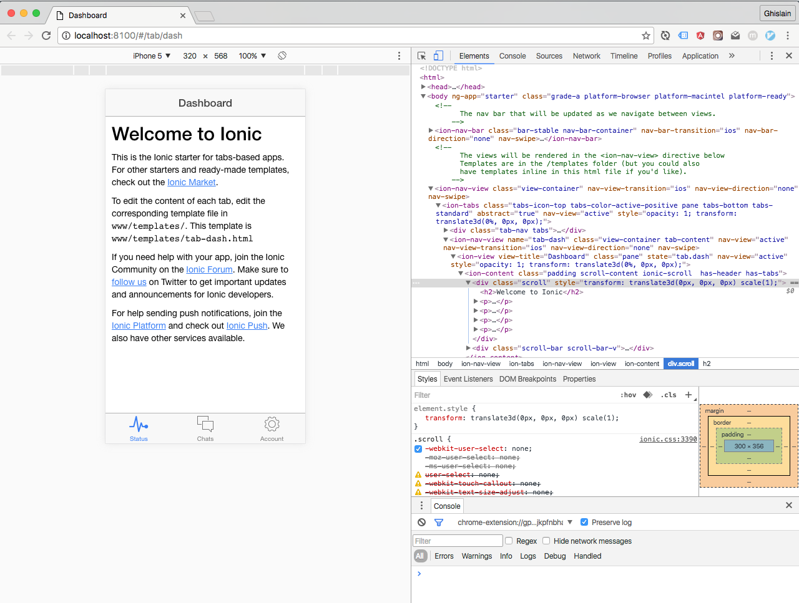
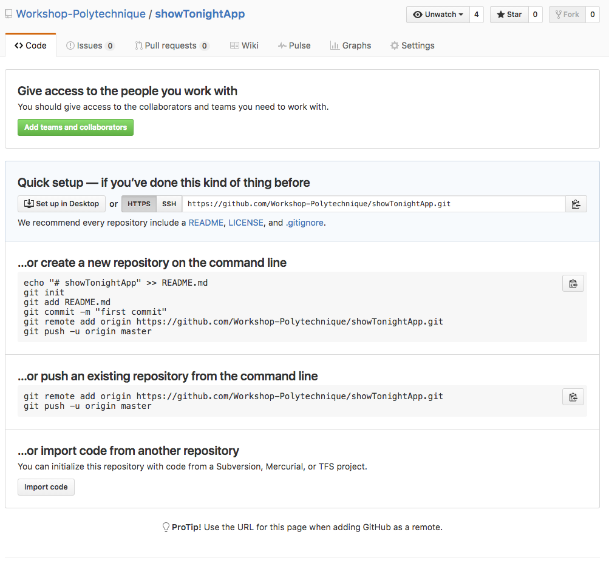
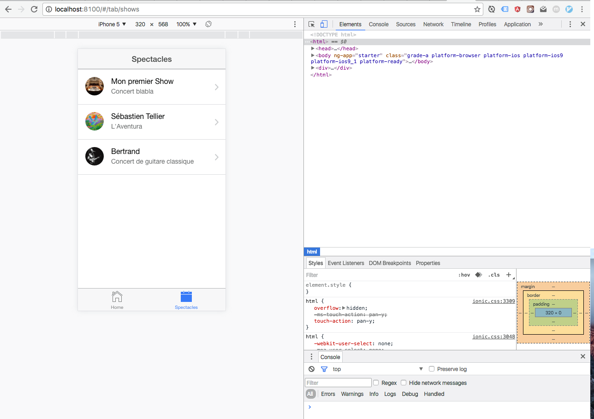
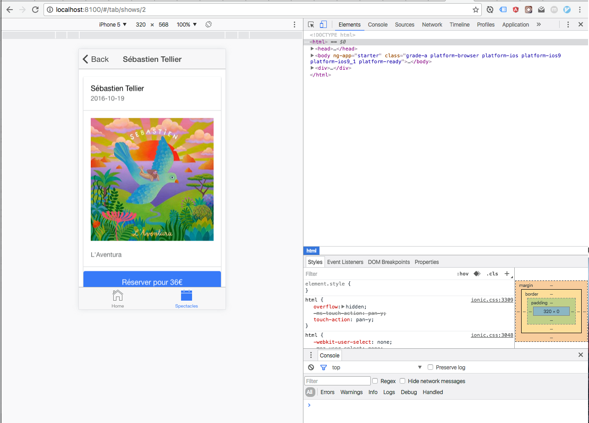
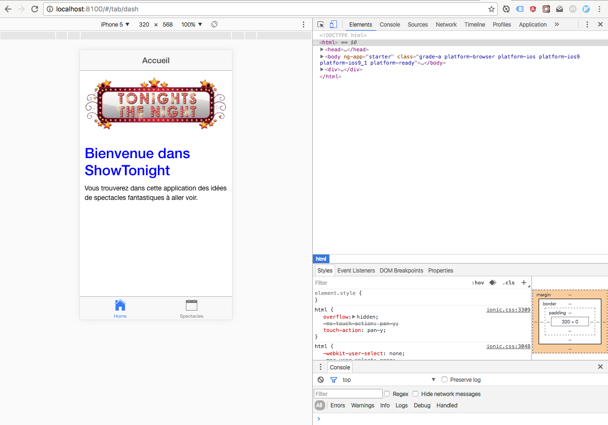

Mobile Workshop #1
=======


Objectifs de l'atelier :

* Lancer une première application mobile avec Ionic
* Modifier cette application pour que les vues correspondantes à nos mockups de l'application "Show Tonight".


Pré-requis :

* Avoir installé l'environnement de travail décrit dans le [workshop Back #1](https://github.com/Workshop-Polytechnique/Back_Workshop_1) et en particulier `node`, `cordova` et `ionic`, ainsi que la création d'un compte Github.


## Création d'une application mobile avec Ionic et sauvegarde sous Github

### Création de l'application

* On va commencer par générer avec Ionic une application basée sur le template `tabs` avec la commande `ionic start showTonightApp tabs` : cela va créer un dossier `showTonightApp` et y installer une application avec le template demandé.

* On va ensuite aller dans le dossier et lister les fichiers générés :


        $ cd showTonightApp
        $ ls
         bower.json        gulpfile.js       ionic.config.json package.json      plugins           scss
         config.xml        hooks             node_modules      platforms         resources         www


* On va maintenant lancer l'application avec la commande `ionic serve` : un petit serveur local va se lancer dans notre terminal, et un navigateur va se lancer sur l'URL `http://localhost:8100` qui correspond à votre application.
* A ce stade, on vous recommande **très fortement** d'utiliser Chrome comme navigateur si ce n'est pas votre navigateur par défaut.
* En faisant un clic-droit puis `Inspecter l'élément` sur la page, vous allez ouvrir l'inspecteur Chrome. En cliquant sur la petit icone de mobile / tablette, vous pourrez ainsi simuler un téléphone mobile de votre choix. À ce stade, l'application doit ressembler à ça :



## Création du projet sur Git & Github

* Sur Github, on va créer un nouveau projet public avec le nom de son choix, `showTonightApp` ici, sans aucun fichier (pas de Readme). Vous arriverez alors sur une page qui ressemble à ça :



* On va maintenant suivre les instructions de Github pour "create a new repository on the command line" et dans le dossier `showTonightApp` sur son terminal, on va exécuter :


        $ git init
        $ git add -A
        $ git commit -m "first commit"
        $ git remote add origin https://github.com/Workshop-Polytechnique/showTonightApp.git
        $ git push -u origin master
        
* En rafraichissant la page, on va maintenant avoir accès à son projet sur Github !
* Optionel : on peut ajouter à ce moment là un fichier `README.md` afin de décrire son projet.

## Personnalisation de l'application ShowTonight

On va maintenant s'attaquer à notre application en la faisant correspondre à nos mockups, sans la brancher sur l'API pour l'instant. 
Notre objectif sera :
* d'avoir un premier onglet présentant l'application
* d'avoir une liste des spectacles disponibles sur le second onglet
* de pouvoir cliquer sur un spectacle pour voir le détail

Pour commencer, nous allons ouvrir le dossier de notre application avec Sublime Text et lancer l'application avec la commande `ionic serve`.

### Découverte de la structure et suppression du 3ème onglet.

L'essentiel du code de l'application est situé dans le dossier `www`. On y trouvera :

* `www/css/` : le dossier contenant les fichiers de style.
* `www/img/` : le dossier contenant les images nécessaires en local (qui ne seront pas chargées depuis internet)
* `www/js/` : le dossier contenant l'essentiel de la logique, dans les fichiers `app.js` (qui comprend notamment le système de routes), `controllers.js` (qui contient la logique propre à chaque page) et (`services.js` qui contient la logique de récupération des données, en local pour le moment)
* `www/lib/` : le dossier contenant les librairies externes nécessaires à faire fonctionner notre application.
* `www/templates/` : le dossier contenant les templates des pages ainsi que du système d'onglets dans le fichier `tabs.html`.
* `www/index.html` : c'est le fichier central chargé au lancement de l'application.


Nous allons effectuer un certain nombre de modifications dans ces fichiers. Nous garderons le nom de la Home `Dashboard` inchangé, mais nous allons modifier les noms des fichiers et des routes `chats` en `shows` et `chat-detail` en `show-detail`.

Voilà ce qu'il faut modifier pour avoir les bonnes routes et les bons fichiers (n'hésiter pas à aller voir les modifications précises dans les fichiers de ce projets.

* Dans le fichier `www/js/app.js`, on va modifier les routes (c'est à dire les URLs) : on va commencer par retirer complètement la partie `tab.account` qui ne nous intéresse pas ici. On va ensuite modifier les routes `tab.chats` et `tab.shows` avec ces éléments :
    * tab.chats : `chats` devient partout `shows`, on va donc avoir un `tab.shows`, dont l'url est `/shows` et la vue associée est `templates/tab-shows.html`. Dans un temps 1, on ne va pas modifier le controller associé.
    * tab.chat-detail : `tab.chat-detail` va devenir `tab.show-detail`, l'url va devenir `/shows/:showId` et la vue associée est `templates/show-detail.html`. Dans un temps 1, on ne va pas modifier le controller associé.

```

          .state('tab.dash', {
            url: '/dash',
            views: {
              'tab-dash': {
                templateUrl: 'templates/tab-dash.html',
                controller: 'DashCtrl'
              }
            }
          })
          .state('tab.shows', {
              url: '/shows',
              views: {
                'tab-shows': {
                  templateUrl: 'templates/tab-shows.html',
                  controller: 'ChatsCtrl'
                }
              }
            })
            .state('tab.show-detail', {
              url: '/shows/:showId',
              views: {
                'tab-shows': {
                  templateUrl: 'templates/show-detail.html',
                  controller: 'ChatDetailCtrl'
                }
              }
          });
``` 

* On va ensuite renommer les 2 fichiers de templates qu'on vient de décrire dans le dossier `templates` et on va supprimer le fichier `tab-account.html`.
* Dans le fichier `tab-dash.html`, on va modifier le contenu pour lui mettre un titre adapté et un contenu correspondant à notre application :


        <ion-view view-title="Accueil">
          <ion-content class="padding">
            <h2>Bienvenue dans ShowTonight</h2>
            <p>
            Vous trouverez dans cette application des idées de spectacles fantastiques à aller voir.
            </p>
          </ion-content>
        </ion-view>
      
      
* Dans le fichier `tab-shows.html`, on va simplement modifier le titre pour le moment en précisant `view-title="Spectacles"`
* Et enfin, dans le fichier `tabs.html` on va enlever la référence au 3ème onglet en la supprimant simplement, et on va modifier à la fois les icones (`icon-off` et `icon-on`) des 2 onglets, leur `title` ainsi que la route `href` pour les faire correspondre aux urls qu'on a mises dans le fichier `app.js` :


      <ion-tabs class="tabs-icon-top tabs-color-active-positive">
      
        <!-- Home Tab -->
        <ion-tab title="Home" icon-off="ion-ios-home-outline" icon-on="ion-ios-home" href="#/tab/dash">
          <ion-nav-view name="tab-dash"></ion-nav-view>
        </ion-tab>
      
        <!-- Shows Tab -->
        <ion-tab title="Spectacles" icon-off="ion-ios-calendar-outline" icon-on="ion-ios-calendar" href="#/tab/shows">
          <ion-nav-view name="tab-shows"></ion-nav-view>
        </ion-tab>
      
      </ion-tabs>


* Vous trouverez un point complet sur les modifications dans ce [commit]( https://github.com/Workshop-Polytechnique/Mobile_Workshop_1/commit/685a854cb16d919d33529a8f5c9a5ca3e5f78691)

Voilà ce que donne votre application maintenant :


### Modification des controllers, services et des vues

Les controllers correspondent à la logique de chaque vue. Les notres vont être très simple :
* `DashCtrl` qui correspond à la page d'accueil n'a pas vraiment de logique propre
* `Shows` qui correspond à la liste des shows va afficher la liste des shows (et va donc devoir la récupérer)
* `ShowDetailCtrl` qui correspond à la page d'un spectacle va devoir afficher le spectacle choisi, et plus tard il permettra d'effectuer une réservation.

On va donc faire quelques modifications :

* Dans notre fichier `app.js` : `ChatsCtrl` va devenir `ShowsCtrl` et `ChatDetailCtrl` va devenir `ShowDetailCtrl`.
* Maintenant qu'on a modifié les noms de nos controllers, on va aller dans le fichier `controllers.js` pour supprimer le `AccountCtrl`, changer les noms des 2 autres cités un peu plus haut et finir par enlever la partie `remove`. Nous allons assigner les données à la variable `$.scope` ce qui permettra de les rendre accessibles dans les vues.


          angular.module('starter.controllers', [])
          
          .controller('DashCtrl', function($scope) {})
          
          .controller('ShowsCtrl', function($scope, Shows) {
            $scope.shows = Shows.all();
          })
          
          .controller('ShowDetailCtrl', function($scope, $stateParams, Shows) {
            $scope.show = Shows.get($stateParams.showId);
          });


Les services correspondent (dans notre cas) à la récupération des données. Dans ce premier Workshop, nous allons écrire les données en dur dans un fichier, elles seront récupérées sur l'API ultérieurement.

* On va aller modifier le fichier `services.js`
    * La factory `Chats` va devenir `Shows`
    * Nous allons créer une variable `shows` contenant un JSON avec les données correspondant aux spectacles qu'on veut afficher
    * On va ensuite garder 2 fonctions : `all` qui va permettre de récupérer tous les spectacles (et qui est appelées dans le `ShowsCtrl` et `get` qui va permettre de récupérer un spectacle à partir de son `id`

```
angular.module('starter.services', [])

.factory('Shows', function() {
  // Might use a resource here that returns a JSON array

  // Some fake testing data
  var shows = [
    {
      id: 1,
      name: "Mon premier Show",
      location: "Salle Pleyel",
      description: "Concert blabla",
      capacity: 500,
      price: 30,
      image: "https://upload.wikimedia.org/wikipedia/commons/thumb/1/16/Salle_Pleyel_5.jpg/220px-Salle_Pleyel_5.jpg",
      date: "2016-10-30",
      url: "https://api-shows-tonight.herokuapp.com/shows/1.json"
    },
    {
      id: 2,
      name: "Sébastien Tellier",
      location: "Nouveau Casino",
      description: "L'Aventura",
      capacity: 500,
      price: 36,
      image: "http://www.gqmagazine.fr/uploads/images/201421/cc/l_aventura_de_s__bastien_tellier_7651.jpeg",
      date: "2016-10-19",
      url: "https://api-shows-tonight.herokuapp.com/shows/2.json"
    },
    {
      id: 5,
      name: "Bertrand",
      location: "Olympia Bruno Coquatrix",
      description: "Concert de guitare classique",
      capacity: 10,
      price: 400,
      image: "https://upload.wikimedia.org/wikipedia/commons/3/3a/Bob-Marley-in-Concert_Zurich_05-30-80.jpg",
      date: "2016-11-05",
      url: "https://api-shows-tonight.herokuapp.com/shows/5.json"
    }
  ];

  return {
    all: function() {
      return shows;
    },
    get: function(showId) {
      for (var i = 0; i < shows.length; i++) {
        if (shows[i].id === parseInt(showId)) {
          return shows[i];
        }
      }
      return null;
    }
  };
});
``` 

Enfin, nous allons modifier les vues pour les faire correspondre à nos shows.

* Dans la vue `show-detail.html`, nous avons la variable `show` qui est assignée par notre controller `ShowDetailCtrl`.
    * le titre de la vue va devenir `{{show.name}}``
    * l'image va devenir `{{show.image}}``
    * et nous allons mettre la description dans un paragraphe : `{{show.description}}`
    * enfin, nous allons ajouter un block bouton en se basant sur la [documentation d'Ionic](http://ionicframework.com/docs/components/#block-buttons)


        <ion-view view-title="{{show.name}}">
          <ion-content class="padding">
            
            <p>
              {{show.description}}
            </p>
            <button class="button button-block button-positive">
              Réserver
            </button>
          </ion-content>
        </ion-view>

* Dans la vue `tab-shows.html`, nous avons la variable `shows` qui est assignée par notre controller `ShowsCtrl`. 
    * nous allons itérer sur la variable `shows` avec la `ng-repeat="show in shows"` pour afficher le détail de chaque Show 
    * le lien va inclure l'id du show et devenir ``href="#/tab/shows/{{show.id}}"``
    * l'image, le nom et la description vont changer comme précédemment

* Vous trouverez un point complet sur ces modifications dans ce [commit]( https://github.com/Workshop-Polytechnique/Mobile_Workshop_1/commit/825032e4700b6dac87a1cbd017f98a0e15dfc943)

Voilà ce que donne votre application maintenant :



### Un peu de style pour finir

Nous allons maintenant modifier un peu le style de certaines pages. 

#### En utilisant les styles d'Ionic

Nous allons commencer par modifier la page d'un show en se basant sur des classes Ionic décrites dans la documentation : [les card-showcase](http://ionicframework.com/docs/components/#card-showcase) (allez lire la documentation !).

Voilà ce que va devenir le fichier `show-detail.html` en modifiant la structure en fonction de la documentation et en ajoutant à l'intérieur la date du spectacles :

      <ion-view view-title="{{show.name}}">
        <ion-content class="padding">
          <div class="list card">
            <div class="item">
              <h2>{{show.name}}</h2>
              <p>{{show.date}}</p>
            </div>
      
            <div class="item item-body">
              
              <p>
                {{show.description}}
              </p>
            </div>
            <button class="button button-block button-positive">
              Réserver pour {{show.price}}€
            </button>
          </div>
        </ion-content>
      </ion-view>
      

Ce qui doit donner ça : 



#### Puis en modifiant les styles nous mêmes.

* Nous allons commencer par ajouter une image appelée `tonigth.png` au dossier `www/img` que vous pouvez récupérer [ici](https://github.com/Workshop-Polytechnique/Mobile_Workshop_1/raw/master/www/img/tonight.png). 
* Nous l'appelerons sur la page d'accueil en ajoutant `` (en notant l'ajout de la classe `logo` pour l'identifier.
* Nous allons aussi ajouter à notre vue une classe `dashboard` pour modifier le style du titre de la page : `<ion-view view-title="Accueil" class="dashboard">` 
* Enfin, nous allons modifier le fichier `css/style.css` pour lui indiquer que notre image ne doit pas dépasser la largeur de l'écran, et que le titre doit être bleu :


      /* Empty. Add your own CSS if you like */
      img.logo {
        width: 100%;
      }
      
      .dashboard h2 {
        color: blue;
      }


Ce qui doit donner ça : 




https://github.com/Workshop-Polytechnique/Mobile_Workshop_1/commit/3a1ba2aee617e217ad8b60218618ec5c924c0e76


